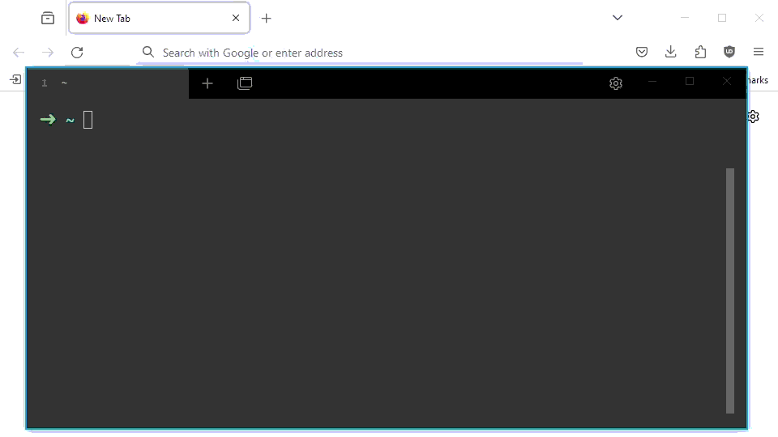

# AsciiArtify: Proof of Concept (PoC)

## Intro

The pilot version of "AsciiArtify" is at the development now, and the Team has took a decision to use ArgoCD as the GitOps system in conjunction with recommended Kubernetes tool. In order to demonstrate the feasibility of concept, the brief demo of basic functionality comes into place. 

## Demo

